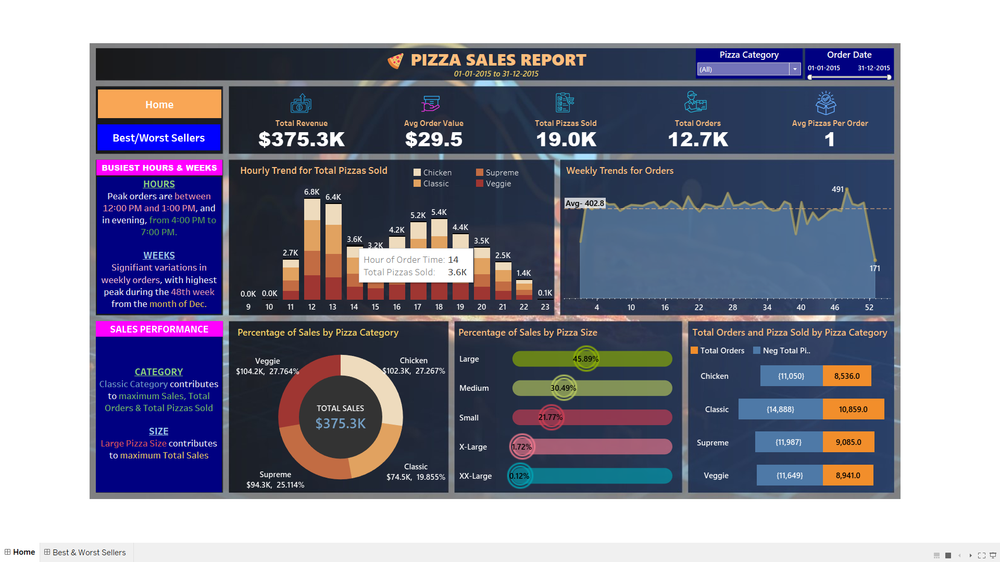
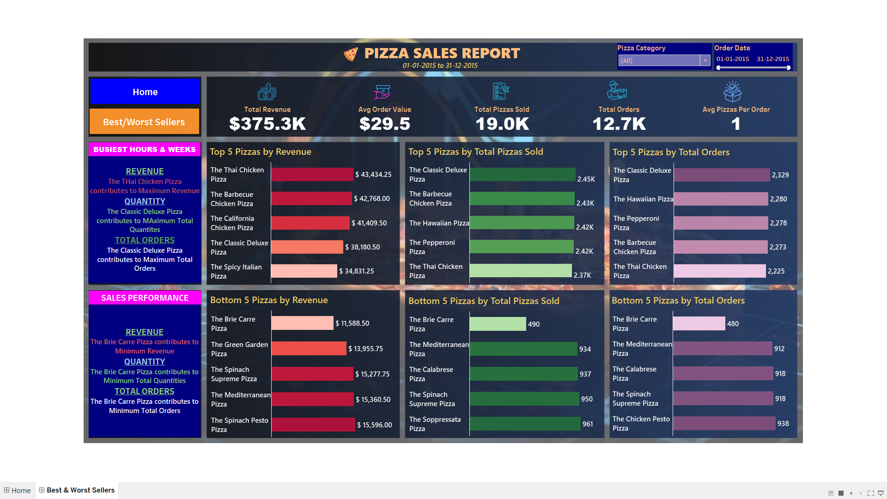

🍕 Pizza Sales Dashboard
An interactive Tableau dashboard for analyzing pizza sales data at Plato’s Pizza — helping identify trends, best sellers, peak hours, and performance insights from January 1, 2015 to December 31, 2015.

📊 Project Overview
This dashboard project helps visualize and analyze pizza sales data to uncover key business insights. It was developed as part of a Business Intelligence (BI) and analytics exercise to support decision-making in a restaurant business scenario.

Main objectives:

Identify best and worst-selling pizzas.

Analyze peak order times and busiest periods.

Measure sales performance across pizza categories and sizes.

Understand overall sales and revenue trends.

🛠️ Tools & Technologies
Tool	Purpose
Tableau Desktop	Dashboard creation and data visualization
Excel	Data cleaning and preprocessing
SQL	Querying and data preparation (optional, if used)

📂 Dataset
Source: Maven Pizza Challenge Dataset

Contains 12 key features such as:

order_id, order_date, order_time, pizza_name, pizza_size, quantity, unit_price, total_price, etc.

✨ Dashboard Features
1️⃣ Home Page

KPIs: Total Revenue, Avg Order Value, Total Pizzas Sold, Total Orders, Avg Pizzas per Order

Visuals:

Hourly trend of pizzas sold

Weekly trends for orders

Sales distribution by pizza category & size

Total orders vs pizzas sold per category

2️⃣ Best/Worst Sellers Page

Top 5 pizzas by revenue, quantity, and orders

Bottom 5 pizzas by revenue, quantity, and orders

Category-wise & size-wise performance

3️⃣ Navigation Bar

Seamless navigation between pages using sidebar buttons ("Home" & "Best/Worst Sellers")

📸 Screenshots
Home Page	Best

Worst Sellers Page

🚀 How to Use
Download the project .twbx file from this repository.

Open it in Tableau Desktop (not Tableau Public).

Explore both pages using the left-side navigation bar.

Interact with filters (pizza category, order date) to customize insights.

📈 Key Insights
Peak Hours: 12 PM – 1 PM & 4 PM – 7 PM

Top-selling Pizza: Classic Deluxe Pizza

Largest revenue contribution: Large-sized pizzas (45.89%)

Maximum orders: 48th week of December
